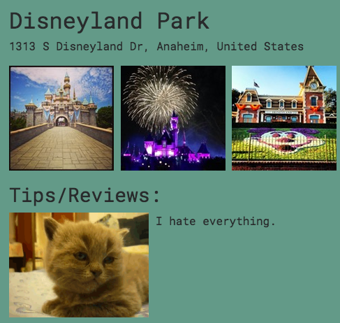

This week did not go according to plan, but that’s okay.

Exactly one month ago today, I started my [Thinkful](thinkful.com) adventure. This week, I reached the end of the Front End Web Development course, which meant it was time to work on my first capstone. The primary requirement was the use of an API.

My initial plan was to make an app called SoCal Now, which would pull location data from Foursquare and recent public Instagram photos to show users what was currently happening at popular SoCal attractions. However, Instagram’s API required OAuth from each user to access any data (no bueno for client-side JavaScript). My idea for a useful app was destroyed and I didn’t have any other ideas.

(this is America I want it now gif)

My mentor suggested that I do something silly. I agreed. She mentioned cat GIFs and an API that produces Chuck Norris quotes. I liked the idea of making something funny. How many chances would I have in my career to make something ridiculous just for the fun of it?

(Leslie Knope hype gif)

I searched a list of APIs AND FOUND AN API THAT RETURNS RANDOM RON SWANSON QUOTES AND MY LIFE WAS CHANGED FOREVER!!!!!

(Ron Swanson godspeed gif)

I titled my Capstone [Kitty Opinions](https://ljyockey.github.io/kitty-opinions/). Users can search for any venue within Foursquare. When they click for more information, a Ron Swanson quote is placed under “Tips/Reviews” with a cat GIF. Here’s an example:

This project was so much fun! I was laughing the entire time I coded. I also gained some useful experience:
- I got more comfortable using objects/arrays to manipulate the DOM.
- DevTools became my BFF while tweaking the CSS.
- Reading documentation for APIs and libraries is no longer daunting.

Most importantly, I discovered that in a week’s time, I can build a Front End app from the ground up while juggling a full-time job.

(Tom Haverford dirt off shoulder gif)

To summarize, I am very happy with the content and functionality of my project. I’m glad that I’ll have something funny on my portfolio. Quite frankly, I wouldn’t want to work for anyone who didn’t find the concept of this app hilarious.

(April Ludgate gif)

Thanks for reading!