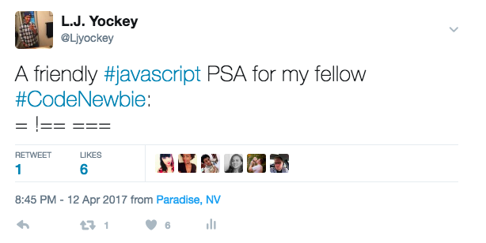

This week, I wrapped up my work in [Thinkful’s](thinkful.com) Front-End course. I made some changes to my Capstone, [Kitty Opinions](https://ljyockey.github.io/kitty-opinions/), after receiving feedback from the Thinkful staff. I also worked on extra assignments, a basic [Tic Tac Toe](https://ljyockey.github.io/tic-tac-toe/) game and a [Logo Search](https://github.com/Ljyockey/logo-search). I feel much more comfortable with semantic HTML, responsive CSS, and functional JavaScript programming now than I did 5 weeks ago.

(Obama mirror gif)

I also took this time to get better-organized. I added Thinkful to my [LinkedIn](linkedin.com/in/ljyockey) account, arranged the repositories on my [GitHub](github.com/ljyockey) account to better showcase my work, and installed a linter for Sublime Text to make the time I spent coding more efficient. The linter proved to be a daunting task, as syntax errors in my user settings (I need a linter for my linter) yielded unfavorable results. I blamed this struggle and many others unrelated to coding (like trying a hot sauce with a liability waiver on the label) on the multiple planets currently in retrograde.

(Ben Wyatt can't hear and dying gif)

I have become more comfortable with the idea that syntax errors are a part of life as a developer. I used to beat myself up over these errors. Now, I can laugh them off and continue to move forward. Overall, I’m glad that I installed a linter, but I will miss the debugging process that resulted in [tweets](twitter.com/Ljyockey) like this:

Now, it’s time to move on to server-side development and learning about Node.js. The fact that I have zero experience in back-end development is making me both nervous and excited for what’s to come. I have the utmost confidence that I will be able to get through it and gain much more knowledge and experience with the help of Thinkful’s curriculum and my awesome mentor, [Rachel](https://twitter.com/CodingLady).

…Of course, when I hear “back-end”, all I can think about is one of the jokes on Disneyland’s Jungle Cruise.

(Jungle cruise gif)

Thanks to Thinkful, I’m feeling confident about my future in Web Development. So much so, that I have withdrawn all of my applications to I.T. jobs in LA, and have postponed my move until after graduation so that I don’t have to pause my coursework. In other words, I’m all in!

(Pam and Jim air five gif)

Thanks for reading!