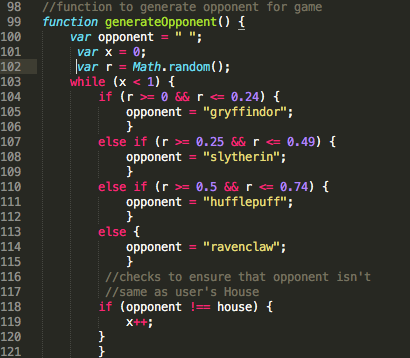
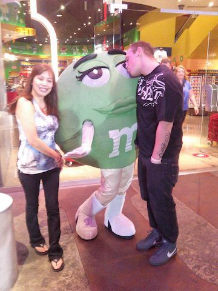
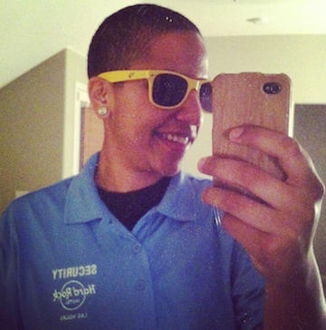

I’m a couple of weeks into the Web Development Bootcamp at Thinkful. It’s been a bit of whirlwind so far. The biggest change I’ve seen in myself is that I now have the confidence that if I ever get stuck, I’ll eventually become unstuck. In other words, I no longer want to do this:

(throwing computer)

Don’t get me wrong, I’m still making a lot of mistakes. For example, it took me a while to figure out why this piece of JavaScript code would occasionally cause my program to crash.

Anyway, thanks to the mentorship and structured curriculum that Thinkful offers, I can now see Web Development as a real career option as opposed to a far-fetched dream. There are a lot of great tools online, but until I made the decision to fully invest in this path, I was quick to give up for weeks or months at a time whenever I got stuck. I’m very excited for what lies ahead!

I’ve discovered that a common question in the industry seems to be, “how did you get into web development?” I usually supply a default answer, explaining that it was suggested to me by a coworker and that I quickly fell in love with it. But, because Ted Mosby is basically my spirit animal, the real story is much longer than that.

(Ted Mosby gif)

I grew up in Lancaster, CA. I graduated high school one year early with dreams of moving to LA and pursue a music career. The dream came true when I turned 19. I moved to North Hollywood and got an internship at a recording studio while I was working on an album. I wrote a few songs for professional singers and assisted producers with recording sessions. It was amazing! To pay the bills, I had a job in the Retail Department at Universal Studios.

Unfortunately, my music career went down the drain. I made some friends at Universal who had moved to Las Vegas, and they suggested that I come live with them. Realizing that my life in LA had hit a wall, I reluctantly agreed.

5 days after I moved to Las Vegas, I was offered a job at M&M’s World. I eventually became a stockroom supervisor, but before that, I dressed up as an M&M’s mascot.

I also spent some time doing Casino Security, per the suggestion of a couple of my roommates.

None of these jobs paid very well, and I had no interest in going to college. One day at work, a vendor suggested to me that I check out code.org. I was willing to take any suggestion I could get to escape dead-end jobs, so I checked it out. It piqued my interest, but went to the back burner. I eventually landed a job in I.T. and fell in love with tech. I got a Codecademy account, at which point an old friend from high school found me on Twitter and told me all about Thinkful.

So, that’s how I got here. I will be using this page to document my adventure through the Wonderful World of Web Development. Thanks for reading!