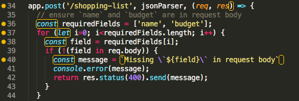
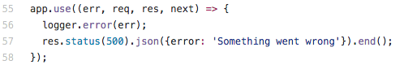

Hello, everybody! It’s been an interesting week, as usual. I started exploring the great beyond…The magical world of backend.

Before diving too deep into the backend, I was introduced to some of the new syntax found in ES6. I loved it. My linter, however, did not.

[Thinkful](thinkful.com) covered a LOT of information at once. In addition to new ES6 syntax, there were promises, closures, and response objects (oh my!). Unlike the Front-End Web Development course, I had no prior exposure to the concepts which were being covered. There was a lot of self-imposed pressure to understand the concepts quickly. I was feeling pretty overwhelmed.

(Lisa Simpson *groans* gif)

After the panic (caused by realizing I may have chosen the wrong career path and being unsure what I was going to do with my life*), my dear friend/reason why I joined Thinkful, [EJ](https://twitter.com/codeability), suggested that I check out some of Net Ninja’s [videos](https://www.youtube.com/channel/UCW5YeuERMmlnqo4oq8vwUpg). My mentor, [Rachel](https://twitter.com/CodingLady), suggested a slew of reading. These suggestions were great, but I still had one big hurdle: parameters.

(I have no idea what I'm doing gif)

It took me a while to understand parameters in front-end functions like the one pictured below because, for a while, I didn’t understand the difference between a parameter and an undefined variable.

I finally understood that parameters were placeholders and that I could give them virtually any name that I wanted. To understand that concept was a victorious feeling. Then the backend brought me back to size with stuff like this:

Middleware tried to pull a fast one on me. I thought that, like front-end functions, middleware could have parameters with any name I wanted. I just assumed that Thinkful was using err, req, etc. for the sake of simplicity. Nope. Once I got that concept, things started to fall into place, somewhat.

Just as I was ready to concede to the life of a Front-End developer, I created a Heroku account and installed Node, Nodemon, and Homebrew on my computer. I started working on some of Thinkful’s exercises that involved creating my own endpoints and realized that the back-end is pretty cool. I have a LOT to learn. But this week taught me to learn how to reach out to different resources to gain the understanding that I need. Pretty soon, the world will be at my fingertips.

(world at fingertips gif)

Thanks for reading!

*I realize now how silly it was to panic about my life-choices after only one day of exposure to new concepts.

(idk what I expected gif)
