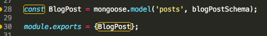
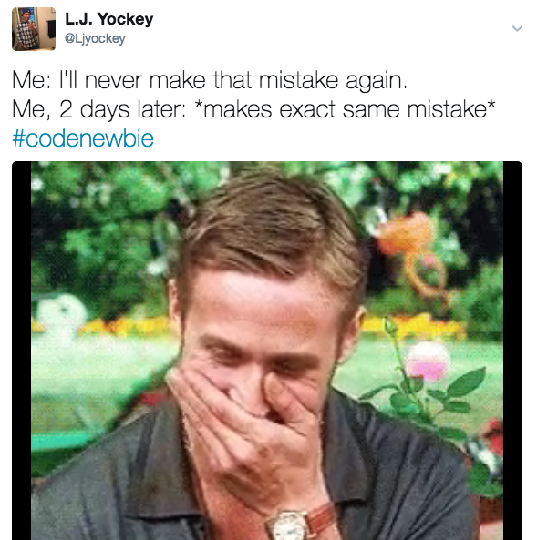

This week, I got to experience working with MongoDB and mlabs as part of [Thinkful’s](thinkful.com) server-side development curriculum. It was an interesting adventure.

The most notable thing I learned about myself was that I have a tendency to skim through readings and suffer through the inevitable consequences when I try to apply the concepts. Let’s take a look at this screenshot:

The schema model on line 28 was something I read about in the Thinkful curriculum and saw in a tutorial on a NetNinja YouTube video. Somehow, I missed the very important detail that that *the first argument in the model must reflect the name of the database collection I wanted to use*. I managed to assume that the name was arbitrary, and thus an arbitrary name was added. Thinking that I had written my code error-free, I was shocked to find that any API requests I called returned empty arrays.

(confused minion gif)

After reaching out to the Thinkful community, I quickly realized my mistake and fixed the model. I was very happy to see that my issue was resolved and my code was working. I was confident that I wouldn’t make this mistake again. I was wrong, which resulted in this tweet:

After grasping a basic understanding of working with a database to add consistency to my apps, I was pretty excited about what I could build. I had just read about basic authentication when my mentor, [Rachel](https://twitter.com/CodingLady), suggested that I try something a little more challenging: add OAuth to one of my older projects.

(Barney Stinson)

I chose to use Twitter to allow users to login and tweet their results after taking my [Disneyland quiz](https://ljyockey.github.io/disney-quiz/). I was pumped… Until I started reading the docs and realized that I had no idea what I was doing. Eventually, I found a package that made Twitter OAuth relatively straightforward. My current challenge: how to get my backend files to communicate with my frontend files.

(gif of cat ignoring human's hand)

It’ll be a great project to have on my portfolio as a new developer. The process is a reminder that there will always be something to learn. Most importantly, I’m growing more and more comfortable with utilizing the various resources available to seek and understand new concepts, which will be vital upon graduation from Thinkful’s program.

Thanks for reading!
