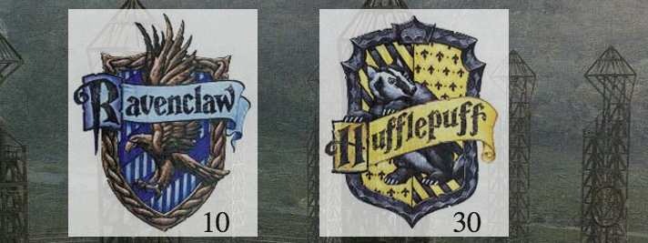

This has been a fun week. Like, a really fun week. I completed a Thinkful assignment to build a multiple-choice quiz about something I know a lot about. I didn’t have to spend any time coming up with an idea for the content of the quiz itself; I knew it would be about my favorite place in the world:

(Matterhorn is my favorite ride and these Star Tours promos were hilarious!)

I love Disneyland. When I had an annual pass back in 2012, I went about once a week. I jotted down all 10 questions for the Disneyland Quiz and switched my focus back to the coding.

One of the requirements for the assignment was that the user should only be able to see one question at a time. Initially, each question was written in the DOM, taking full advantage of CSS’s {display: none;} as well as jQuery’s hide() and show() methods. It worked, but my mentor challenged me to have only one form on the DOM and to update it using the values of an object. At first, I felt a little lost.

(Darth Vader Lost at Disneyland)

The revised version contained an array of objects. Each object in the array had a question key, a key for each possible answer, and a key indicating the correct answer. I used a counter to tell the computer which index in the array to display on the DOM. Long story short, it was much more efficient and I learned a lot. Once I was done revising the Javascript, I got to style it. I was super excited when I found the Waltograph font! Also, this was the first time I used the {position: relative} ruleset with confidence. By the time I was finished and I showed it off to my friends, I felt unstoppable.

(Darth Vader sword stone)

Realizing how much fun it was to build something based on one of my interests, I decided to take a break from the Thinkful curriculum to update text-based game I had built during a Codecademy course. Once again, I got to focus on one of my favorite things.

(Harry Potter/Quidditch)

Harry Potter has always been magical to me. The [Quidditch game](https://ljyockey.github.io/quidditch/) that I built* took users on an adventure where they got to choose their house and experience circumstances of their choosing in the Quidditch Cup Final against a randomly-assigned house.

There was one major problem with the draft submitted to Codecademy: I hated forms so much at the time that I used prompts any time I needed a user input. It left a lot of room for user error and frustration.

(Ron Weasley Wingardium Leviosa)

Using a lot of what I learned while building the Disneyland quiz, I created an object, where each key was a different HTML form. Depending on which radio input the user submitted, a different form would get pushed to the DOM. The app was already built to keep score, but my mentor suggested that I added a scoreboard for the user to see. Since {position: relative} was such a hard concept for me to understand, I am very proud of the scoreboard I was able to build.



The image for the user’s house crest (Ravenclaw, in this case) and the randomly assigned opponent are each wrapped in a `<div>`. The scores are each wrapped in a `<span>` set to relative positioning so that they can sit on top of the images. The scores update in real-time thanks to their values being contained in a variable in the Javascript file. It looks much better now!

Finally, I got to learn about APIs by building a simple [video-search app](https://ljyockey.github.io/thinkful-tube/) using the YouTube API. As I tested the app, I used one of my favorite bands for the user input.

(Taking Back Sunday)

Like I said, this has been a fun week. More and more, I can see web development as an actual career patch and not just some hobby. Thanks for reading!

```
*The Quidditch game is work-in-progress and is not responsive yet.
It looks pretty bad on mobile platforms. I’m saving that piece of the project for a rainy day. :)
```